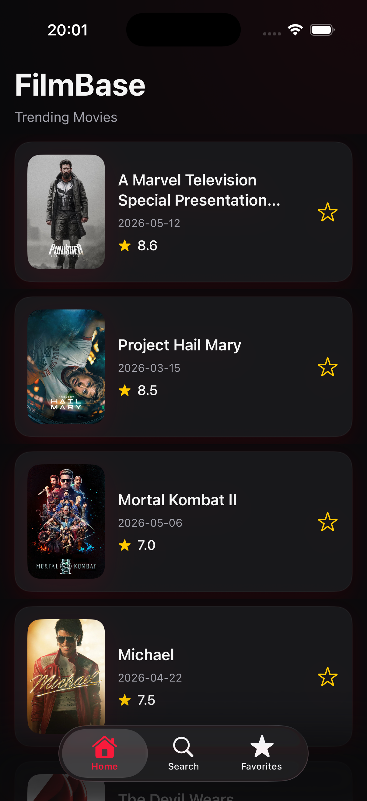
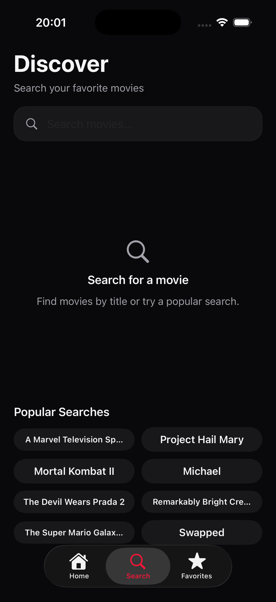
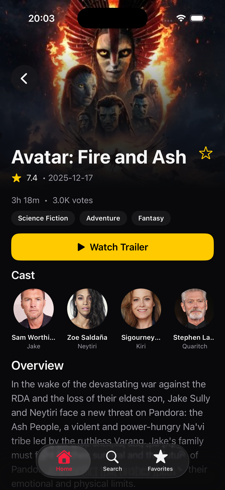
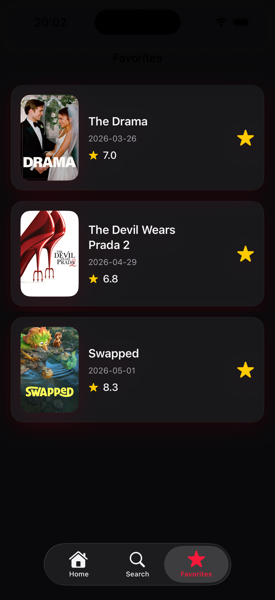

# 🎬 FilmBase

FilmBase is a modern cinematic movie discovery app built with SwiftUI and powered by the TMDB API.

The app allows users to explore trending movies, search for films, view detailed movie information, watch trailers, and save favorites with a modern dark-themed interface inspired by streaming platforms.

---

# 📱 Screenshots

| Home | Search |
|------|------|
|  |  |

| Detail | Favorites |
|------|------|
|  |  |

---

# ✨ Features

- 🔥 Trending movies feed
- 🔎 Real-time movie search
- ⭐ Favorite movies system
- 🎥 Movie detail pages
- 👥 Cast section
- ▶️ Trailer support via YouTube
- 📄 Pagination / infinite scrolling
- 💀 Skeleton loading states
- ⚠️ Error handling & empty states
- 📳 Haptic feedback interactions
- 🌙 Dark cinematic UI

---

# 🛠 Tech Stack

- SwiftUI
- SwiftData
- MVVM Architecture
- Repository Pattern
- Async/Await
- TMDB API
- Combine

---

# 🧱 Architecture

FilmBase follows the MVVM architecture pattern with a clean and scalable folder structure.

The project uses:
- Reusable SwiftUI components
- Repository abstraction for networking & persistence
- Async/await for modern concurrency
- SwiftData for local favorite storage

---

# 🚀 Installation

```bash
git clone https://github.com/rdenizalp/FilmBase.git
```

1. Open the project in Xcode
2. Add your TMDB API key
3. Run the app on iOS Simulator or device

---

# 🎨 Design

FilmBase features a modern cinematic dark interface with:

- Soft glow effects
- Floating tab bar
- Minimal UI components
- Smooth animations & transitions

---

# 📌 Requirements

- iOS 17+
- Xcode 16+
- Swift 5.9+

---

# 🙌 Credits

Movie data provided by TMDB API.

https://www.themoviedb.org/
